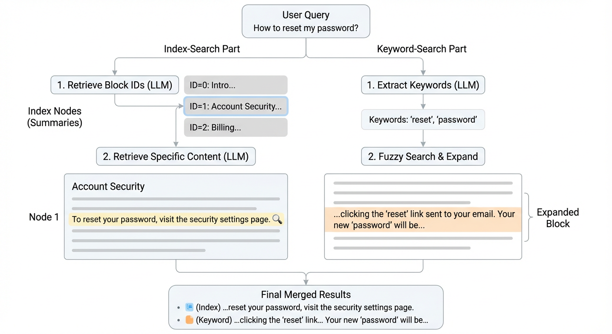

# MarkdownIndex




MarkdownIndex is a light-weight tool for searching long markdown documents (inspired by [PageIndex](https://github.com/VectifyAI/PageIndex), but developed totally from scratch). It generates index based on the structure of the markdown document, defined by the titles of different levels. It requires no vector database and text chunking, and only needs an OpenAI endpoint.

The retrieval is based on two methods:

* **Pageindex way**: We create index for each document, the LLM reads the index and then extract the relevant contents based on the user query, just like humna reading a book.

* **Fuzzy keyword search**: The LLM extracts keywords and their synonyms from user query, then a fuzzy search is performed to extract relevant contents based on the RapidFuzzy library.

Other features:

* **Supports both English and Chinese index**. When creating index, user can specify the language of the document, so *MarkdownIndex* will use the same language for LLM prompts during the index generation process. Currently Chinese and English are supported. This prevents the problem of language mixing in the index and improve the retrieval accuracy.

* **Smart node splitting**. When a node/section in the index is too long, it will be splitted automatically. This is useful to malformed markdown files (e.g., some titles are missing so a content block is way to large)

* **Markdown table support**. When retrieve table contents, *MarkdownIndex* automatically adds the table header to the retrieval resul so LLM can understand the table content. This is useful for markdowns with large tables.

## Installation

## Quick Usage

Create index from markdown content (conduct multiple LLM queries to generate the readable index):

```python
from markdown_index import MarkdownIndex, LLMConfig

markdown_content = open("article.md", "r", encoding="utf-8").read()

index = MarkdownIndex(
    markdown_content,
    llm_config=LLMConfig(openai_model_name="google/gemini-3-flash-preview"),
    language="cn",  # 'cn' for chinese, 'en' for english
)
```

Retrieval relevant contents from user query:

```python
results = index.retrieve(
    query="User's question about this document",
    n_index_results=5,
    n_keyword_results=5
)

print(json.dumps(results, ensure_ascii=False, indent=2))
```

Save index (Convert the index to a JSON-formatted string, which could be stored in the filesystem):
```python
serialized_index = index.serialize_index()
print(json.dumps(json.loads(serialized_index), ensure_ascii=False, indent=2))
```

Load index (Load the index from the serialized JSON string):
```python
index_recovered = MarkdownIndex(
    index_data=serialized_index,
    llm_config=LLMConfig(openai_model_name="google/gemini-3-flash-preview"),
    language="cn",
)
```

## API Refrences
